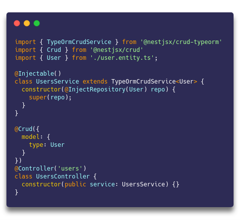

<div align="center">
  <h1>CRUD</h1>
</div>
<div align="center">
  <strong>for RESTful APIs built with NestJs</strong>
</div>

<br />

<div align="center">
  <sub>Built with :purple_heart: by
  <a href="https://twitter.com/MichaelYali">@MichaelYali</a> and
  <a href="https://github.com/dataui/crud/graphs/contributors">
    Contributors
  </a>
  <div align="center">
    :star2: :eyes: :zap: :boom:
  </div>
</div>

<br />

We believe that everyone who's working with NestJs and building some RESTful services and especially some CRUD functionality will find `@dataui/crud` microframework very useful.

## Features



- :electric_plug: Super easy to install and start using the full-featured controllers and services :point_right:

- :octopus: DB and service agnostic extendable CRUD controllers

- :mag_right: Reach query parsing with filtering, pagination, sorting, relations, nested relations, cache, etc.

- :telescope: Framework agnostic package with query builder for a frontend usage

- :space_invader: Query, path params and DTOs validation included

- :clapper: Overriding controller methods with ease

- :wrench: Tiny config (including globally)

- :gift: Additional helper decorators

- :pencil2: Swagger documentation

## Install

yarn add @dataui/crud-typeorm

## Packages

- [**@dataui/crud**](https://www.npmjs.com/package/@dataui/crud) - core package which provides `@Crud()` decorator for endpoints generation, global configuration, validation, helper decorators ([docs](https://gid-oss.github.io/dataui-nestjs-crud/controllers/#description))
- [**@dataui/crud-request**](https://www.npmjs.com/package/@dataui/crud-request) - request builder/parser package which provides `RequestQueryBuilder` class for a frontend usage and `RequestQueryParser` that is being used internally for handling and validating query/path params on a backend side ([docs](https://gid-oss.github.io/dataui-nestjs-crud/requests/#frontend-usage))
- [**@dataui/crud-typeorm**](https://www.npmjs.com/package/@dataui/crud-typeorm) - TypeORM package which provides base `TypeOrmCrudService` with methods for CRUD database operations ([docs](https://gid-oss.github.io/dataui-nestjs-crud/service-typeorm/))

## Documentation

- :dart: [General Information](https://gid-oss.github.io/dataui-nestjs-crud/)
- :video_game: [CRUD Controllers](https://gid-oss.github.io/dataui-nestjs-crud/controllers/#description)
- :horse_racing: [CRUD ORM Services](https://gid-oss.github.io/dataui-nestjs-crud/controllers/#description)
- :trumpet: [Handling Requests](https://gid-oss.github.io/dataui-nestjs-crud/requests/#description)

## Build library and run tests

```
yarn install
yarn clean
yarn build
docker compose up -d
yarn test:coverage
```

## Make a release

- Merge a PR on master.
- Pull and checkout master
- Update Changelog and commit
- Run tests `yarn clean && yarn build && docker-compose up -d && yarn test:coverage`
- Run `yarn pub` - this will publish on the npm repo (need to be logged under dataui `yarn login`)

## Support

Any support is welcome. At least you can give us a star :star:

## Contributors

### Code Contributors

This project exists thanks to all the people who contributed. [[Contribute](CODE_OF_CONDUCT.md)].
<a href="https://github.com/dataui/crud/graphs/contributors"></a>

#### Organizations

Currently this project is supported by [Get It Done](https://www.getitdone.rocks/)

## License

[MIT](LICENSE)
